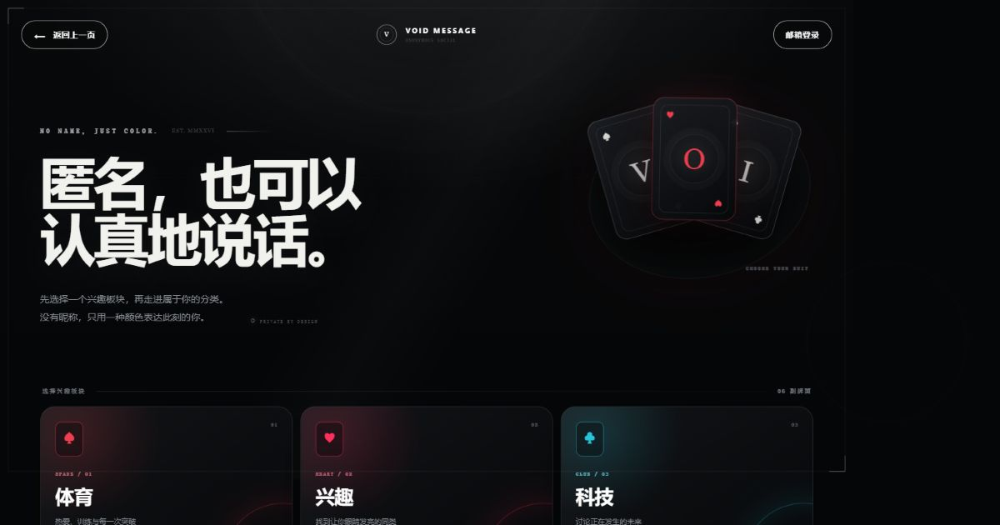
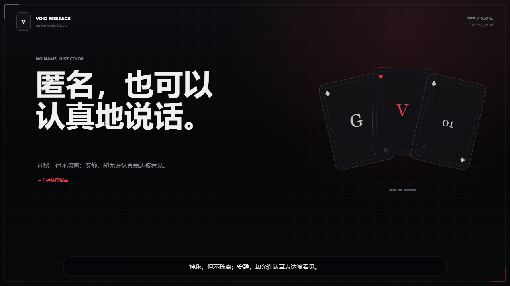
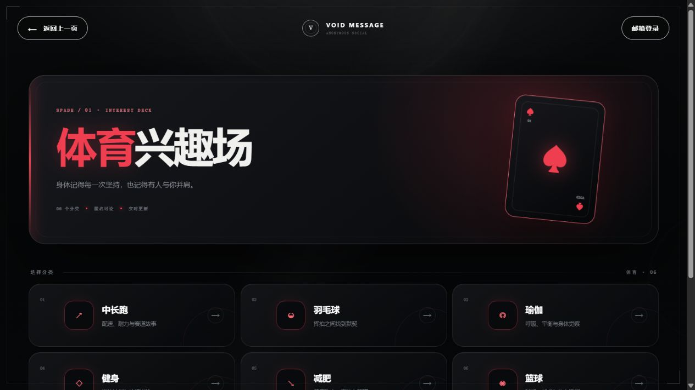
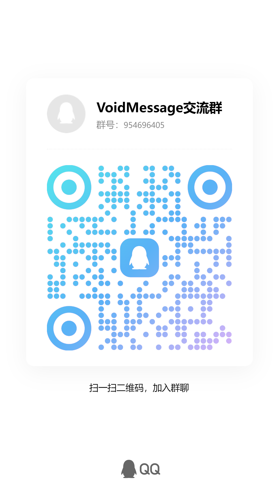

<code>PRIVATE BY DESIGN · EST. MMXXVI · NO NAME, JUST COLOR</code>

# VOID MESSAGE

### 匿名，也可以认真地说话。

不是经营人设的广场，而是一间由颜色、兴趣与真话组成的暗室。

  
  
  

<table>
  <tr>
    <td width="50%" align="center">
      
       
      <strong>▶ 03:00 · 完整产品演示</strong>
       
      邮箱登录 · 温柔男声 · 实时点击 · 中文字幕
    </td>
    <td width="50%" align="center">
      
       
      <strong>♠ INTEREST DECK · 真实页面</strong>
       
      六大板块 · 三十六房间 · 黑红镂空视觉
    </td>
  </tr>
</table>

  点击左侧画面播放原始 MP4 · 点击右侧画面进入线上体育兴趣场

---

## 00 / MANIFESTO

VOID MESSAGE 重新定义匿名：不把人变成不可辨认的噪点，也不要求用户经营昵称、头像和关注关系。邮箱只负责建立私有账号边界；公开空间只留下颜色，让同一个人可以被温和辨认，却不必暴露现实身份。

> **Private by design.** 
> 邮箱用于认证，颜色用于相遇，消息用于表达。

| 06 | 36 | 1.2 s | 100 |
| :---: | :---: | :---: | :---: |
| 兴趣板块 | 独立房间 | 增量同步周期 | 首屏消息上限 |

### 设计判断

| 想解决的问题 | VOID MESSAGE 的答案 |
| --- | --- |
| 匿名社区仍容易被昵称与人设绑架 | 全程无昵称、无粉丝数、无公开邮箱 |
| 完全随机身份难以形成连续交流 | 服务端分配稳定颜色，蝙蝠侠轮廓统一承载 |
| 多用户消息容易重复、覆盖或乱序 | 房间隔离、游标增量、时间与 ID 双重稳定排序 |
| 暗黑界面容易牺牲可读性 | 黑灰基底、克制暗红、明确留白与响应式字号 |

---

## 01 / EXPERIENCE

~~~mermaid
flowchart LR
    A[邮箱注册 / 登录] --> B[获得颜色身份]
    B --> C[选择兴趣板块]
    C --> D[选择细分房间]
    D --> E[发送匿名消息]
    E --> F[按时间增量同步]
    F --> D
~~~

<strong>展开全部 36 个兴趣房间</strong>

 

| 板块 | 房间 |
| --- | --- |
| ♠ 体育 | 中长跑 · 羽毛球 · 瑜伽 · 健身 · 减肥 · 篮球 |
| ♥ 兴趣 | 星座 · 塔罗 · MBTI · 明星 · 旅游 · 宠物 |
| ♣ 科技 | 机器人 · 芯片 · 人工智能 · 天体物理 · 量子力学 · 理论探究 |
| ♦ 艺术 | 音乐 · 绘画 · 舞蹈 · 摄影 · 电影 · 设计 |
| A 学习 | 数学 · 雅思 · 四六级 · 编程 · 物理 · 化学 |
| J 游戏 | 原神 · 王者荣耀 · 三角洲 · 我的世界 · 英雄联盟 · 独立游戏 |

---

## 02 / ENGINEERING EDGE

### 01 · COLOR IDENTITY

服务端从受控色板中为账号建立颜色身份。客户端不能自行伪造任意颜色，公开消息也不返回邮箱或内部用户 ID，实现 **可辨认，但不过度暴露**。

### 02 · ORDERED REAL-TIME FLOW

首次进入房间读取最近 100 条；后续请求携带最后一条消息 ID，只获取新增记录。查询使用 **created_at ASC, id ASC** 保持稳定顺序，客户端再按 ID 去重合并。

### 03 · ROOM ISOLATION

每次读取和写入都校验 community 白名单。消息表以 community、created_at、id 建立复合索引，不同兴趣房间拥有独立数据流，多用户并发不会互相覆盖。

### 04 · AUTH BOUNDARY

密码采用 **PBKDF2-HMAC-SHA256 / 210,000 iterations / 16-byte random salt / 256-bit output**。会话使用 32 字节随机令牌，D1 只保存 SHA-256 令牌摘要。

---

## 03 / SYSTEM DESIGN

~~~mermaid
flowchart TB
    subgraph CLIENT[CLIENT · REACT 19]
      UI[Board / Room / Chat UI]
      POLL[1.2 s Cursor Polling]
    end

    subgraph EDGE[EDGE · CLOUDFLARE WORKER]
      AUTH[Auth API]
      SESSION[Session Guard]
      MESSAGE[Message API]
    end

    subgraph DATA[DATA · D1 / SQLITE]
      ACCOUNTS[(accounts)]
      USERS[(users)]
      SESSIONS[(auth_sessions)]
      MESSAGES[(messages)]
    end

    UI --> AUTH
    UI --> MESSAGE
    POLL --> MESSAGE
    AUTH --> ACCOUNTS
    AUTH --> SESSIONS
    MESSAGE --> SESSION
    SESSION --> SESSIONS
    MESSAGE --> USERS
    MESSAGE --> MESSAGES
~~~

| 层级 | 技术 | 职责 |
| --- | --- | --- |
| Interface | React 19 · TypeScript · CSS | 页面状态、响应式交互、暗黑视觉系统 |
| Application | Vinext · Next.js-compatible routing | RSC、页面路由与 API handlers |
| Edge | Cloudflare Workers | 低延迟请求处理与运行时边界 |
| Data | Cloudflare D1 · SQLite · Drizzle ORM | 类型安全 schema、索引、查询与迁移 |
| Crypto | Web Crypto API | PBKDF2、SHA-256、随机盐与会话令牌 |
| Delivery | OpenAI Sites | 构建、D1 binding 与线上发布 |

更深入的设计决策、数据模型和扩展路径见 [System Architecture](docs/ARCHITECTURE.md)。

---

## 04 / SECURITY & PRIVACY

| 边界 | 当前实现 |
| --- | --- |
| 密码 | PBKDF2-HMAC-SHA256 加盐摘要，不保存明文 |
| 会话 | 32 字节随机令牌；数据库只保存 SHA-256 摘要 |
| Cookie | HttpOnly · SameSite=Lax · HTTPS 下启用 Secure |
| 登录限流 | 同一邮箱每 15 分钟最多 10 次 |
| 注册限流 | 同一邮箱每小时最多 3 次 |
| 公开消息 | 仅返回 id、body、color、createdAt、mine |
| 输入边界 | 预定义 community 与颜色白名单；正文 1–500 字符 |
| 缓存策略 | 认证与消息响应使用 private / no-store |

> 匿名是一种产品表达，不是规避治理的借口。 
> 邮箱验证、密码找回、举报与内容治理仍在 Roadmap 中，不在 README 中虚构为已完成功能。

[阅读完整安全设计 →](docs/SECURITY.md)

---

## 05 / API SURFACE

<strong>查看服务端接口</strong>

 

| Method | Endpoint | 说明 |
| --- | --- | --- |
| POST | /api/auth/register | 创建邮箱账号并建立匿名会话 |
| POST | /api/auth/login | 校验密码并轮换会话 |
| POST | /api/auth/logout | 注销当前会话 |
| GET | /api/session | 恢复当前颜色身份 |
| PATCH | /api/session | 更新服务端受控颜色 |
| GET | /api/messages?community=...&after=... | 首次或增量获取房间消息 |
| POST | /api/messages | 向指定房间发送消息 |

---

## 06 / RUN LOCALLY

环境要求：**Node.js 22.13+** 与 **pnpm**。

~~~bash
pnpm install
pnpm dev
~~~

默认访问 <code>http://localhost:3000</code>。

~~~bash
pnpm lint
pnpm build
pnpm start
~~~

生成数据库迁移：

~~~bash
pnpm db:generate
~~~

完整环境、D1 binding、迁移与发布步骤见 [Deployment Guide](docs/DEPLOYMENT.md)。

---

## 07 / REPOSITORY MAP

~~~text
VoidMessage/
├─ app/                  页面、邮箱认证、消息 API 与视觉系统
├─ db/                   D1 查询层与 Drizzle schema
├─ drizzle/              SQLite 数据库迁移
├─ public/               实际页面截图、视频、字幕与品牌素材
├─ docs/                 产品、架构、安全与部署文档
├─ .github/              Issue / Pull Request 模板
├─ .openai/hosting.json  Sites 托管配置
└─ README.md             产品与工程展示入口
~~~

### Documentation Vault

| 文档 | 内容 |
| --- | --- |
| [Product Manual](docs/PRODUCT.md) | 产品主张、信息架构、视觉语言与成功指标 |
| [System Architecture](docs/ARCHITECTURE.md) | 数据流、表结构、消息顺序与扩展决策 |
| [Security Model](docs/SECURITY.md) | 认证、隐私、限流、已知边界与生产清单 |
| [Deployment Guide](docs/DEPLOYMENT.md) | 本地、预发布、D1 迁移与生产发布 |
| [Contributing](CONTRIBUTING.md) | 分支、提交、验证与隐私协作规范 |
| [03:00 Demo](public/void-message-guide-email.mp4) | 温柔男声完整演示 |
| [Captions](public/void-message-guide.vtt) | 中文字幕轨道 |

---

## 08 / ROADMAP

- [x] 六大板块与 36 个兴趣房间
- [x] 邮箱注册、登录、退出与颜色身份
- [x] 多房间增量消息同步、去重与自动滚动
- [x] 三分钟温柔男声产品演示与中文字幕
- [ ] 邮箱验证与安全找回密码
- [ ] WebSocket / Durable Objects 实时通道
- [ ] 举报、限流观测与内容治理后台
- [ ] PWA 安装、消息提醒与无障碍审计

---

<code>CREATED &amp; CARED FOR BY gonna</code>

由 **gonna** 设计与开发。 
会根据真实用户反馈持续更新功能、分类、安全边界与使用体验。

### Speak freely. Stay undefined.

♠ · ♥ · ♣ · ♦

---

## 09 / COMMUNITY

### 群

  

